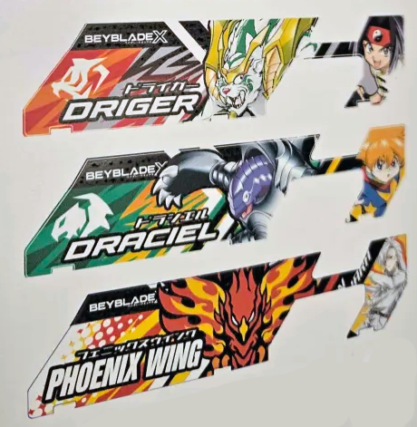

# ⚡ BeyBattlePass

> Create printable photo cutouts for the **Beyblade Battle Pass** – free & open source.

[](https://github.com/MaximilianRTS/BeyBattlePass/blob/main/LICENSE)
[](https://vuejs.org/)
[](https://vite.dev/)
[](https://github.com/MaximilianRTS/BeyBattlePass)
[](https://github.com/MaximilianRTS/BeyBattlePass/actions/workflows/deploy.yml)
[](https://maximilianrts.github.io/BeyBattlePass/)

Upload your images, position them on the template, scale and adjust – then export as high-quality PDF, PNG, or SVG. Perfect for printing custom Battle Pass designs at home.



---

## ✨ Features

- **Image Upload** – Drag & drop or select images to place on the template
- **Live Preview** – See your design in real-time with a grid overlay and crosshair alignment
- **Pan & Zoom** – Drag to reposition, scroll to zoom, or use the precision sliders
- **Auto-Fit Detection** – Automatically fits images that match the template proportions
- **Multi-Design Session** – Add multiple designs to a single PDF
- **PDF Export** – A4 format, 300 DPI, multiple designs per page with automatic page breaks
- **PNG Export** – High-resolution single cutout export
- **SVG Export** – Vector-based single cutout export
- **Bilingual** – German and English interface (auto-detected, switchable in the footer)
- **Persistent Settings** – Workspace position and zoom saved locally via IndexedDB
- **Fully Offline** – No server, no accounts, works entirely in the browser

---

## 🚀 Getting Started

### Prerequisites

- [Node.js](https://nodejs.org/) >= 18

### Installation

```bash
# Clone the repository
git clone https://github.com/MaximilianRTS/BeyBattlePass.git
cd BeyBattlePass

# Install dependencies
npm install

# Start the development server
npm run dev
```

The app will be available at `http://localhost:5173`.

### Production Build

```bash
npm run build
npm run preview
```

---

## 🛠️ Tech Stack

| Technology | Purpose |
|------------|---------|
| [Vue 3](https://vuejs.org/) | Reactive UI framework |
| [Vite](https://vite.dev/) | Build tool & dev server |
| [jsPDF](https://github.com/parallax/jsPDF) | PDF generation |
| [vue-i18n](https://vue-i18n.intlify.dev/) | Internationalization (DE/EN) |
| IndexedDB | Local data persistence |

---

## 📁 Project Structure

```
BeyBattlePass/
├── public/
│   ├── Bilder/               # Preview images
│   └── template.png          # Default Battle Pass template
├── src/
│   ├── components/
│   │   ├── AppFooter.vue     # Footer with language switcher & GitHub link
│   │   └── Workspace.vue     # Core editor component (preview, controls, export)
│   ├── i18n/
│   │   ├── index.js          # i18n configuration
│   │   └── locales/          # DE and EN translation files
│   ├── utils/
│   │   ├── imageProcessing.js  # Image manipulation (transparency, bounds detection)
│   │   └── storage.js          # IndexedDB persistence service
│   ├── views/
│   │   └── EditorView.vue    # Main editor page
│   ├── App.vue               # Root component
│   ├── main.js               # App entry point
│   └── style.css             # Global styles & design tokens
├── index.html
├── package.json
├── vite.config.js
└── LICENSE
```

---

## 🖨️ How It Works

1. **Upload** an image (any format supported by your browser)
2. **Position** it using drag & drop or the precision sliders
3. **Add to PDF** – your design is saved to the session list
4. **Repeat** with more images for multi-design PDFs
5. **Export** as PDF (A4, 300 DPI) – ready for printing!

The template defines a transparent cutout area where your image shows through. The tool calculates the exact print dimensions in millimeters for pixel-perfect output.

---

## 🌍 Internationalization

The app supports **German** and **English**. The language is detected from the browser settings and can be changed via the footer switcher. Translation files are in `src/i18n/locales/`.

To add a new language:
1. Create a new JSON file (e.g., `fr.json`) in `src/i18n/locales/`
2. Register it in `src/i18n/index.js`

---

## 🤝 Contributing

Contributions are welcome! Please read [CONTRIBUTING.md](CONTRIBUTING.md) for details.

**Quick start:**

1. **Fork** the repository
2. **Create** a feature branch (`git checkout -b feature/amazing-feature`)
3. **Commit** your changes (`git commit -m 'Add amazing feature'`)
4. **Push** to the branch (`git push origin feature/amazing-feature`)
5. **Open** a Pull Request

Found a bug? [Open an issue](https://github.com/MaximilianRTS/BeyBattlePass/issues) 🐛

---

## 📄 License

This project is licensed under the **MIT License** – see the [LICENSE](LICENSE) file for details.

**You are free to use, modify, and distribute this code.** Please give credit to the original author.

---

## 👤 Author

**Maximilian Reitsberger** (Maximilian RTS)

- GitHub: [@MaximilianRTS](https://github.com/MaximilianRTS)
